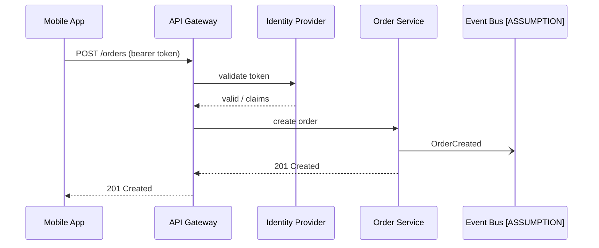

# Produce a Diagram as Code

## Purpose
Produce a text-based diagram that renders correctly, conveys one clear message, and can be versioned, reviewed and updated alongside code and documentation.

## When to use
- A process, interaction, architecture, data model or lifecycle described in prose needs a picture.
- A diagram must live in a repository, wiki or pull request and stay diffable.
- An existing image-only diagram must be recreated so it can be maintained.

## When not to use
- The architecture must be modeled at defined abstraction levels with notation rules. Use `c4-model` (this skill can then render its views).
- A business process must follow BPMN 2.0 semantics for analysis or automation. Use `bpmn-model`.
- The behavior itself is not yet understood (states, messages unclear). Use `state-model` or `sequence-flow` to analyze first.

## Inputs
Required:
- A description of what to draw: elements, relationships, flow or sequence.

Optional, improves quality:
- Preferred syntax (Mermaid or PlantUML) and the renderer/platform where it will be displayed (renderers differ in supported features).
- Audience and the one message the diagram must convey.
- Naming conventions, existing diagrams, color or styling rules.

If the description is missing, ask for it. If the syntax is unspecified, default to Mermaid and say so.

## Process
1. State the diagram's single message in one sentence (for example "how a token is validated before an order is created").
2. Choose the diagram type from the content: sequence (time-ordered messages), flowchart/activity (decisions and steps), state (lifecycle of one entity), class/ER (structure and cardinality), C4 container/component (architecture), Gantt (schedule), mindmap (hierarchy).
3. Extract elements and relationships from the description into a list; mark anything inferred as `[ASSUMPTION]` rather than silently adding it.
4. Define stable, meaningful IDs separate from display labels (for example `orderSvc["Order Service"]`) so renaming labels does not break edges.
5. Write the diagram code, keeping 7-15 nodes per diagram; split into several diagrams or use subgraphs/boxes when larger.
6. Label edges with verbs or message names and include protocol or sync/async markers where they matter (for example `-)` for async in Mermaid sequence).
7. Verify syntax mentally against the chosen language: quoted labels with special characters, no reserved words as IDs, balanced blocks (`alt/else/end`, `subgraph/end`, `@startuml/@enduml`).
8. Check semantics: every element is connected or intentionally standalone, arrow directions match the flow, cardinalities and states are consistent with the text.
9. Add a legend or note only when notation is non-obvious; avoid decorative styling.
10. Provide the code, a two-line reading guide, and the assumptions list.
11. If the user's goal continues, suggest `c4-model` for architecture views, `sequence-flow` for interaction detail or `state-model` for lifecycle rules.

## Output format
````markdown
## <Diagram title>
Message: <one sentence> | Type: <sequence/flowchart/state/ER/C4/...> | Syntax: <Mermaid/PlantUML>

```mermaid
<diagram code>
```

How to read: <1-2 sentences>
Assumptions: <[ASSUMPTION] items or "none">
Open questions: <items that would change the diagram>
````

## Quality checklist
- [ ] The diagram type matches the content (time order = sequence, lifecycle = state, structure = class/ER).
- [ ] Syntax is valid: blocks closed, special characters quoted, IDs unique.
- [ ] Every element and edge traces to the description or is marked `[ASSUMPTION]`.
- [ ] Node count stays readable (about 15 or fewer), or the diagram is split.
- [ ] Edges are labeled; async versus sync is visible where relevant.
- [ ] The title states the message, not just the system name.
- [ ] All checks pass; if any fails, revise the output and re-run this checklist before answering.

## Common pitfalls
- Using a flowchart for everything. Interactions over time belong in a sequence diagram; entity lifecycles in a state diagram.
- Relying on renderer-specific features without knowing the platform. Stick to core syntax unless the renderer is known.
- Drawing "everything" in one picture. One diagram, one message; link related diagrams.

## Example
Input: "Mobile app calls API gateway, gateway validates token with the identity provider, then calls order service, which publishes OrderCreated."

Excerpt of output:

Assumption: the event is published to a broker; the description does not name it.
