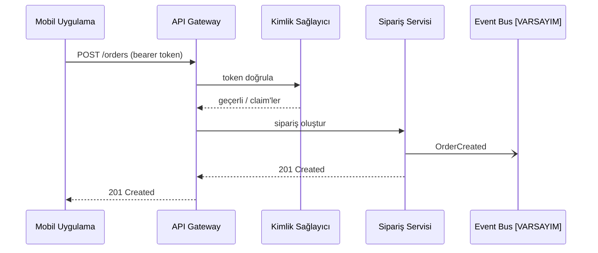

# Kod Olarak Diyagram Üretme

## Amaç
Doğru render edilen, tek ve net bir mesaj veren; kod ve dokümantasyonla birlikte sürümlenebilen, gözden geçirilebilen ve güncellenebilen metin tabanlı bir diyagram üretmek.

## Ne zaman kullanılır
- Düz yazıyla anlatılmış bir süreç, etkileşim, mimari, veri modeli veya yaşam döngüsünün görsele dönüşmesi gerektiğinde.
- Diyagramın bir repoda, wiki'de veya pull request'te yaşaması ve diff'lenebilir kalması gerektiğinde.
- Yalnızca görsel olarak bulunan bir diyagramın bakımı yapılabilsin diye yeniden oluşturulması gerektiğinde.

## Ne zaman kullanılmaz
- Mimari, tanımlı soyutlama seviyelerinde ve notasyon kurallarıyla modellenecekse `c4-model` kullanılır (bu skill ardından görünümlerini çizebilir).
- Bir iş süreci analiz veya otomasyon için BPMN 2.0 semantiğine uymalıysa `bpmn-model` kullanılır.
- Davranışın kendisi henüz anlaşılmamışsa (durumlar, mesajlar belirsiz) önce analiz için `state-model` veya `sequence-flow` kullanılır.

## Girdiler
Zorunlu:
- Neyin çizileceğinin tarifi: öğeler, ilişkiler, akış veya sıra.

İsteğe bağlı, kaliteyi artırır:
- Tercih edilen sözdizimi (Mermaid veya PlantUML) ve diyagramın gösterileceği render ortamı/platform (render motorlarının desteklediği özellikler farklıdır).
- Hedef kitle ve diyagramın vermesi gereken tek mesaj.
- İsimlendirme kuralları, mevcut diyagramlar, renk veya stil kuralları.

Tarif yoksa iste. Sözdizimi belirtilmemişse Mermaid'i varsayılan al ve bunu belirt.

## Süreç
1. Diyagramın tek mesajını bir cümleyle yaz (ör. "sipariş oluşturulmadan önce token'ın nasıl doğrulandığı").
2. Diyagram türünü içerikten seç: sequence (zamana göre sıralı mesajlar), flowchart/aktivite (kararlar ve adımlar), state (tek bir varlığın yaşam döngüsü), class/ER (yapı ve kardinalite), C4 container/component (mimari), Gantt (takvim), mindmap (hiyerarşi).
3. Öğeleri ve ilişkileri tariften bir listeye çıkar; çıkarım yaptığın her şeyi sessizce eklemek yerine `[VARSAYIM]` olarak işaretle.
4. Görünen etiketlerden ayrı, kalıcı ve anlamlı ID'ler tanımla (ör. `orderSvc["Sipariş Servisi"]`); böylece etiket değişince bağlantılar bozulmaz.
5. Diyagram kodunu yaz; diyagram başına 7-15 düğüm tut, daha büyükse birden fazla diyagrama böl veya subgraph/kutu kullan.
6. Bağlantıları fiillerle veya mesaj adlarıyla etiketle; önemliyse protokolü veya senkron/asenkron işaretini ekle (ör. Mermaid sequence'ta asenkron için `-)`).
7. Sözdizimini seçilen dile göre zihinsel olarak doğrula: özel karakter içeren etiketler tırnakta, ayrılmış kelimeler ID olarak kullanılmamış, bloklar dengeli (`alt/else/end`, `subgraph/end`, `@startuml/@enduml`).
8. Anlamı kontrol et: her öğe bağlı ya da bilinçli olarak bağımsız, ok yönleri akışla uyumlu, kardinaliteler ve durumlar metinle tutarlı.
9. Yalnızca notasyon açık değilse lejant veya not ekle; süsleme amaçlı stil kullanma.
10. Kodu, iki satırlık okuma rehberini ve varsayım listesini ver.

## Çıktı formatı
````markdown
## <Diyagram başlığı>
Mesaj: <tek cümle> | Tür: <sequence/flowchart/state/ER/C4/...> | Sözdizimi: <Mermaid/PlantUML>

```mermaid
<diyagram kodu>
```

Nasıl okunur: <1-2 cümle>
Varsayımlar: <[VARSAYIM] maddeleri veya "yok">
Açık sorular: <diyagramı değiştirebilecek noktalar>
````

## Kalite kontrol listesi
- [ ] Diyagram türü içerikle uyumlu (zaman sırası = sequence, yaşam döngüsü = state, yapı = class/ER).
- [ ] Sözdizimi geçerli: bloklar kapalı, özel karakterler tırnakta, ID'ler tekil.
- [ ] Her öğe ve bağlantı tarife dayanıyor ya da `[VARSAYIM]` olarak işaretli.
- [ ] Düğüm sayısı okunabilir (yaklaşık 15 veya altı) ya da diyagram bölünmüş.
- [ ] Bağlantılar etiketli; gerektiğinde senkron/asenkron ayrımı görünür.
- [ ] Başlık yalnızca sistem adını değil mesajı ifade ediyor.

## Sık yapılan hatalar
- Her şey için flowchart kullanmak. Zaman içindeki etkileşimler sequence diyagramına, varlık yaşam döngüleri state diyagramına aittir.
- Platformu bilmeden render motoruna özgü özelliklere güvenmek. Render ortamı bilinmiyorsa temel sözdizimiyle kal.
- "Her şeyi" tek resme sığdırmak. Bir diyagram, bir mesaj; ilişkili diyagramları birbirine bağla.

## Örnek
Girdi: "Mobil uygulama API gateway'i çağırır, gateway token'ı kimlik sağlayıcıyla doğrular, sonra sipariş servisini çağırır, servis OrderCreated yayınlar."

Çıktıdan bir bölüm:

Varsayım: event bir broker'a yayınlanıyor; tarif broker'ın adını vermiyor.
