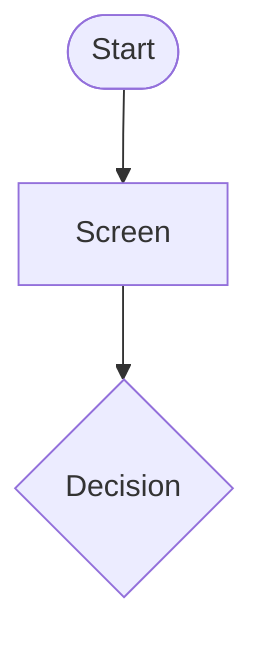

# Design a User Flow

## Purpose
Define exactly how a specific user reaches a specific goal in the product, including every decision, system response and failure path, so wireframes, requirements and tests all start from the same complete picture.

## When to use
- A new feature or journey needs to be designed before wireframes.
- An existing flow has drop-off or support tickets and must be redesigned.
- Designers, product and engineering need a shared view of happy and unhappy paths.

## When not to use
- The need is the end-to-end experience across channels and time, including emotions. Use `customer-journey-map`.
- The question is how content and navigation are organized across the product. Use `information-architecture`.
- The flow is agreed and screens need detailing. Use `wireframe-spec`.

## Inputs
Required:
- The user (persona or role) and the goal the flow serves.

Optional, improves quality:
- Requirements or user stories, business rules, current flow and its analytics, platform (web, mobile, kiosk), authentication state, regulatory constraints.

If the user or goal is missing, ask for them. Other gaps become `[ASSUMPTION]` or open questions in the flow.

## Process
1. State the flow's user, goal, trigger and success end state in one line each; one flow serves one goal.
2. List all entry points (deep link, notification, menu, error redirect) and the user's state at entry (logged in or not, data already present, device).
3. Draft the happy path as the minimal sequence of steps; for each step note screen, user action and system response.
4. Mark every decision point (user choice or system condition) as a diamond with all branches named; each branch must end in a step, an exit or a loop back.
5. Add unhappy paths per step: validation errors, system/network failure, timeouts, permission denied, business-rule rejection, cancellation and back navigation; define recovery for each so no path dead-ends.
6. Add edge states: first use / empty, partial data, returning mid-flow (saved progress), concurrent sessions, limits (lockout, rate limits), accessibility needs affecting the path.
7. Remove unnecessary steps: challenge each screen and input (can the system infer it, defer it or prefill it?) and count steps to the goal.
8. Mark external dependencies and system actions (emails, SMS, third-party calls) and where the user waits.
9. Produce the step table and a diagram as code (e.g. Mermaid flowchart) with consistent shapes: start/end, screen, decision, system action.
10. Label inferred rules `[ASSUMPTION]`, list open questions, and suggest `wireframe-spec` for screens and `edge-case-elicitation` or `acceptance-criteria` for requirements.

## Output format
````markdown
# User Flow: <goal>
User: <persona/role> · Trigger: <...> · Success end state: <...> · Platform: <...>

## Entry Points
- ...

## Steps
| # | Screen / State | User action | System response | Next | Errors / branches |
|---|---|---|---|---|---|

## Decision Points
- D1 <condition>: yes → <step>, no → <step>

## Error and Recovery Paths
| Where | Failure | Message intent | Recovery |
|---|---|---|---|

## Edge States
- ...

## Diagram


## Assumptions and Open Questions
- ...
````

## Quality checklist
- [ ] The flow serves one user and one goal with a clear success end state.
- [ ] Every decision has all branches, and every branch ends in a step, exit or loop.
- [ ] Each step that can fail has a recovery path; no dead ends.
- [ ] Empty, first-use, interrupted and limit states are covered.
- [ ] The diagram and the step table match one-to-one.
- [ ] Business rules not given by the user are marked `[ASSUMPTION]`.
- [ ] All checks pass; if any fails, revise the output and re-run this checklist before answering.

## Common pitfalls
- Drawing only the happy path. Most support tickets come from the error and edge paths.
- Mixing several goals into one giant flow. Split per goal and link flows at their exits.
- Designing screens instead of decisions. Keep layout out of the flow; it belongs in wireframes.

## Example
Input: "Password reset in mobile banking, including errors and lockout."

Excerpt of output:
- Success end state: user signed in with a new password; old sessions revoked.
- D1 Customer number and phone match? no → generic message "We couldn't verify these details" (no account enumeration) → retry; 3 failures → lockout 30 min `[ASSUMPTION: confirm policy]`.
- Error: SMS code expired → "Code expired, send a new one" → resend with 60 s cooldown.
- Open question: Is branch or call-center verification a fallback when the phone number has changed?
