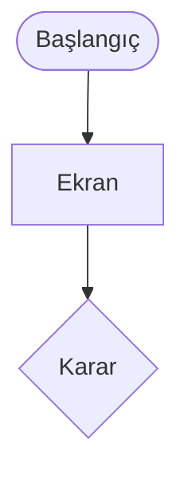

# Kullanıcı Akışı Tasarlama

## Amaç
Belirli bir kullanıcının üründe belirli bir hedefe tam olarak nasıl ulaştığını; her karar, sistem yanıtı ve hata yoluyla birlikte tanımlamak. Böylece wireframe'ler, gereksinimler ve testler aynı eksiksiz resimden başlar.

## Ne zaman kullanılır
- Yeni bir özellik veya yolculuğun wireframe'den önce tasarlanması gerektiğinde.
- Mevcut bir akışta kayıp veya destek kaydı varsa ve yeniden tasarlanması gerektiğinde.
- Tasarım, ürün ve yazılım ekiplerinin mutlu ve mutsuz yollar için ortak bir görünüme ihtiyacı olduğunda.

## Ne zaman kullanılmaz
- İhtiyaç, kanallar ve zaman boyunca duygular dahil uçtan uca deneyimse `customer-journey-map` kullanılır.
- Soru, içeriğin ve navigasyonun ürün genelinde nasıl düzenlendiğiyse `information-architecture` kullanılır.
- Akış üzerinde uzlaşıldı ve ekranların detaylandırılması gerekiyorsa `wireframe-spec` kullanılır.

## Girdiler
Zorunlu:
- Kullanıcı (persona veya rol) ve akışın hizmet ettiği hedef.

İsteğe bağlı, kaliteyi artırır:
- Gereksinimler veya kullanıcı hikâyeleri, iş kuralları, mevcut akış ve analitiği, platform (web, mobil, kiosk), oturum durumu, mevzuat kısıtları.

Kullanıcı veya hedef yoksa iste. Diğer eksikler akışta `[VARSAYIM]` veya açık soru olur.

## Süreç
1. Akışın kullanıcısını, hedefini, tetikleyicisini ve başarılı son durumunu birer satırda yaz; bir akış tek bir hedefe hizmet eder.
2. Tüm giriş noktalarını (derin bağlantı, bildirim, menü, hata yönlendirmesi) ve kullanıcının giriş anındaki durumunu (oturum açık mı, veri var mı, cihaz) listele.
3. Mutlu yolu en kısa adım dizisi olarak taslakla; her adım için ekranı, kullanıcı aksiyonunu ve sistem yanıtını yaz.
4. Her karar noktasını (kullanıcı seçimi veya sistem koşulu) tüm dalları adlandırılmış bir karar düğümü olarak işaretle; her dal bir adımda, çıkışta veya geri dönüşte bitmeli.
5. Her adım için mutsuz yolları ekle: doğrulama hataları, sistem/ağ hatası, zaman aşımı, yetki reddi, iş kuralı reddi, iptal ve geri gitme. Hiçbir yol çıkmazda bitmesin diye her birinin kurtarma yolunu tanımla.
6. Uç durumları ekle: ilk kullanım / boş durum, eksik veri, akışın ortasına geri dönme (kayıtlı ilerleme), eşzamanlı oturumlar, sınırlar (kilitlenme, istek sınırı), yolu etkileyen erişilebilirlik ihtiyaçları.
7. Gereksiz adımları çıkar: her ekranı ve girdiyi sorgula (sistem çıkarabilir mi, erteleyebilir mi, önceden doldurabilir mi?) ve hedefe kadar adım sayısını say.
8. Dış bağımlılıkları ve sistem aksiyonlarını (e-posta, SMS, üçüncü taraf çağrıları) ve kullanıcının beklediği yerleri işaretle.
9. Adım tablosunu ve tutarlı şekiller kullanan (başlangıç/bitiş, ekran, karar, sistem aksiyonu) bir diagram-as-code şeması (ör. Mermaid flowchart) üret.
10. Çıkarılan kuralları `[VARSAYIM]` olarak etiketle, açık soruları listele; ekranlar için `wireframe-spec`, gereksinimler için `edge-case-elicitation` veya `acceptance-criteria` öner.

## Çıktı formatı
````markdown
# Kullanıcı Akışı: <hedef>
Kullanıcı: <persona/rol> · Tetikleyici: <...> · Başarılı son durum: <...> · Platform: <...>

## Giriş Noktaları
- ...

## Adımlar
| # | Ekran / Durum | Kullanıcı aksiyonu | Sistem yanıtı | Sonraki | Hatalar / dallar |
|---|---|---|---|---|---|

## Karar Noktaları
- K1 <koşul>: evet → <adım>, hayır → <adım>

## Hata ve Kurtarma Yolları
| Nerede | Hata | Mesajın amacı | Kurtarma |
|---|---|---|---|

## Uç Durumlar
- ...

## Şema


## Varsayımlar ve Açık Sorular
- ...
````

## Kalite kontrol listesi
- [ ] Akış tek bir kullanıcıya ve tek bir hedefe hizmet ediyor, başarılı son durum net.
- [ ] Her kararın tüm dalları var ve her dal bir adım, çıkış veya döngüyle bitiyor.
- [ ] Hata verebilecek her adımın kurtarma yolu var; çıkmaz yok.
- [ ] Boş, ilk kullanım, yarıda kalma ve sınır durumları kapsandı.
- [ ] Şema ile adım tablosu birebir örtüşüyor.
- [ ] Kullanıcının vermediği iş kuralları `[VARSAYIM]` olarak işaretli.
- [ ] Tüm kontroller geçiyor; biri geçmiyorsa çıktıyı düzelt ve yanıtlamadan önce listeyi yeniden çalıştır.

## Sık yapılan hatalar
- Yalnızca mutlu yolu çizmek. Destek kayıtlarının çoğu hata ve uç yollardan gelir.
- Birden fazla hedefi tek dev akışta birleştirmek. Hedef başına ayır ve akışları çıkışlarında birbirine bağla.
- Kararlar yerine ekran tasarlamak. Yerleşimi akışın dışında tut; o wireframe'in işidir.

## Örnek
Girdi: "Mobil bankacılıkta şifre sıfırlama, hatalar ve kilitlenme dahil."

Çıktıdan bir bölüm:
- Başarılı son durum: kullanıcı yeni şifreyle giriş yaptı; eski oturumlar sonlandırıldı.
- K1 Müşteri numarası ve telefon eşleşiyor mu? hayır → genel mesaj "Bu bilgileri doğrulayamadık" (hesap varlığı ifşa edilmez) → tekrar dene; 3 hata → 30 dk kilit `[VARSAYIM: politikayı teyit et]`.
- Hata: SMS kodunun süresi doldu → "Kodun süresi doldu, yenisini gönder" → 60 sn beklemeyle yeniden gönderim.
- Açık soru: Telefon numarası değiştiyse şube veya çağrı merkezi doğrulaması yedek yol olarak var mı?
